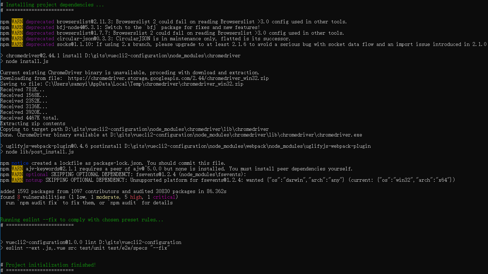
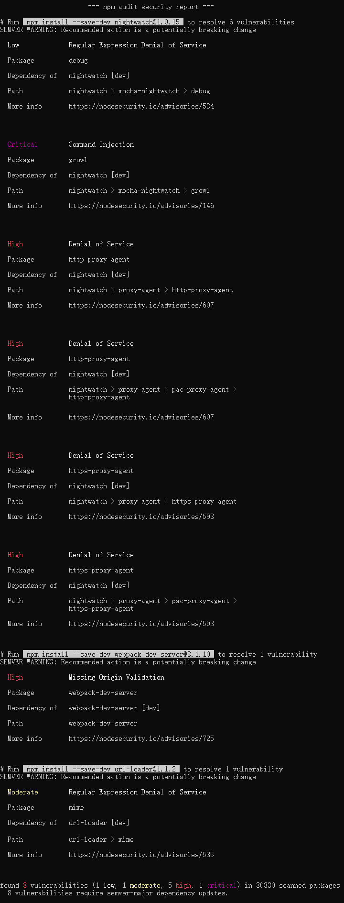

# vuecli2安装

## 安装提示
一路选择默认配置，开始安装到安装之后的命令行提示


### 5个 `npm WARN`
警告安装的一些包已经过时。如果实际使用中确实发现了问题，就需要更新出现问题的包。

### chromedriver 相关
1. 和跨浏览器测试相关，具体不懂。
2. 看起来是运行了该包里的`install.js`从而安装了一些东西。
3. [参考](https://www.npmjs.com/package/chromedriver)

### `uglifyjs-webpack-plugin@0.4.6 postinstall`
看起来是安装完`uglifyjs-webpack-plugin`包后有执行了`lib/post_install.js`进行了一些后续安装工作。

### `package-lock.json`
提示应该提交该文件，因为它会作为其他人安装依赖的依据

### `ajv`
`ajv-keywords`依赖`ajv`，但是没有安装。验证 JSON 数据格式和类型用的，貌似是 eslint 会用到该包。如果使用时出错可以再安装。

### 两个`SKIPPING OPTIONAL DEPENDENCY`
跳过了两个可选的依赖。万一需要再安装。


## vulnerabilities
1. 其中说明了总共有 8 个 vulnerablity，并给出了危险程度。`npm audit fix`可以修复，`npm audit`可以查看细节。
2. 先进入目录，然后`npm audit`查看细节

3. 可以看出来都是因为现在用的三个包都是版本，存在一些已经修复的漏洞。
4. 虽然建议安装新版本，但是因为都是大版本升级，所以在暂时不了解详情的情况下，还是先不升级了。


## eslint
```sh
Running eslint --fix to comply with chosen preset rules...
# ========================


> vuecli2-configuration@1.0.0 lint D:\gits\vuecli2-configuration
> eslint --ext .js,.vue src test/unit test/e2e/specs "--fix"
```
1. 大概就是提示可以使用 eslint 进行代码审查，而且可以带上`--fix`参数来直接修复。
2. 尝试一下修改`HelloWorld.vue`中的代码为当前 eslint 配置所认为的不规范的形式
    ```js
    export default {
      name: 'HelloWorld',
      data () {
        return {
          msg: 'Welcome to Your Vue.js App'
        }
    }, // 没有缩进且加了多余的逗号
    }
    ```
3. 执行 eslint 审查该文件。Unix 系统应该`./node_modules/.bin/eslint ./src/components/HelloWorld.vue`就可以了，但 Windows 系统默认情况下要写完整的路径`D:/gits/vuecli2-configuration/node_modules/.bin/eslint ./src/components/HelloWorld.vue`。运行后提示如下：    
    ```sh
    93:1  error  Expected indentation of 2 spaces but found 0  indent
    93:2  error  Unexpected trailing comma                     comma-dangle

    ✖ 2 problems (2 errors, 0 warnings)
    2 errors, 0 warnings potentially fixable with the `--fix` option.
    ```
4. 再按照提示说的加上`--fix`参数，就可以在审查的同时自动修复：`D:/gits/vuecli2-configuration/node_modules/.bin/eslint --fix ./src/components/HelloWorld.vue`。但因为是自动修复，所以并不会提示哪里不规范。
5. vue-cli 的 eslint 是在`npm run dev`之后是默认打开的，任何时候修改文件，都会自动进行检查。
